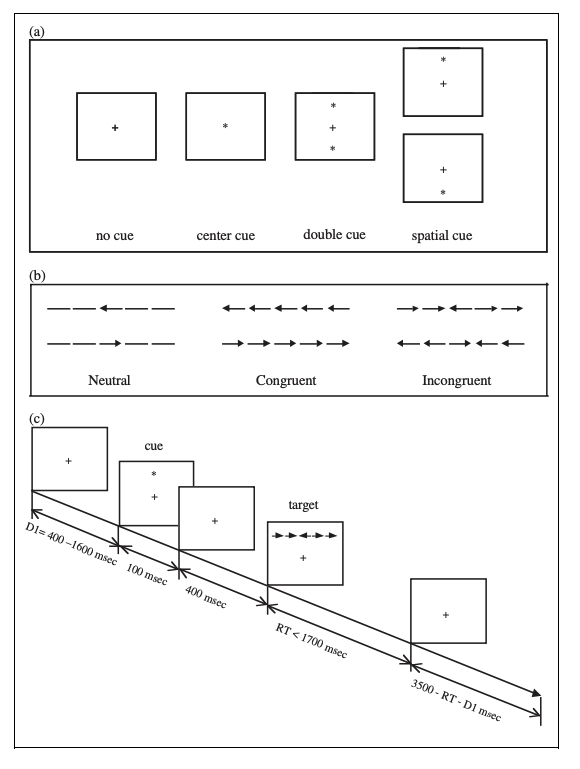

The Attention Network Task (ANT) is a combination of two tasks: cued reaction time (RT), and the flanker task.
The ANT requires participants to determine whether a central arrow points left or right. Thus, for each trial, there is a measure of reaction time and accuracy.
The arrow appears above or below the fixation point (centre of screen) and may or may not be accompanied by flanking arrows (flankers).

For one trial: a cue is presented (center cue, double cue, spatial cue, or no cue), and then after a delay, the target (arrows) are presented, and the subject quickly presses the left or right arrow keys to indicate the direction that the center arrow is pointing. The amount of time it takes the subject to press the correct arrow key is the RT for that trial.
The arrows will either be presented congruently (flanking arrows facing the same direction as center arrow) or incongruently (flanking arrows facing random directions relative to center arrow).

The task examines three components of the attention network (alerting, orienting, and executive) separately (more in /papers/Fan_etal).

The **alerting effect** is calculated by subtracting the mean RT of the double-cue conditions from the mean RT of the no-cue conditions.

The **orienting effect** is calculated by subtracting the mean RT of the spatial cue conditions from the mean RT of the center cue conditions.

The **executive effect** is calculated by subtracting the mean RT of all the congruent flanking conditions from the mean RT of the incongruent flanking conditions. 
